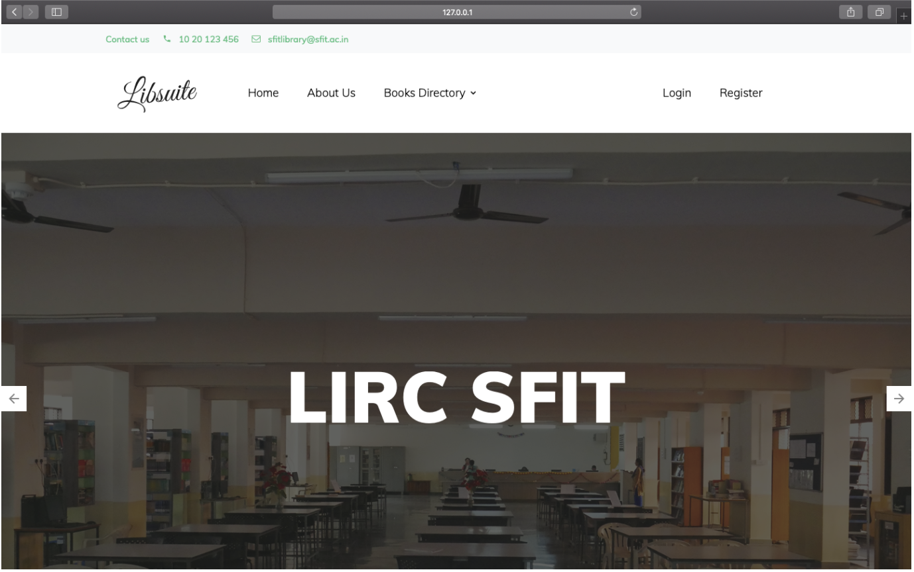
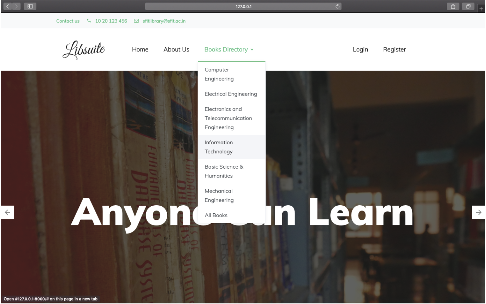
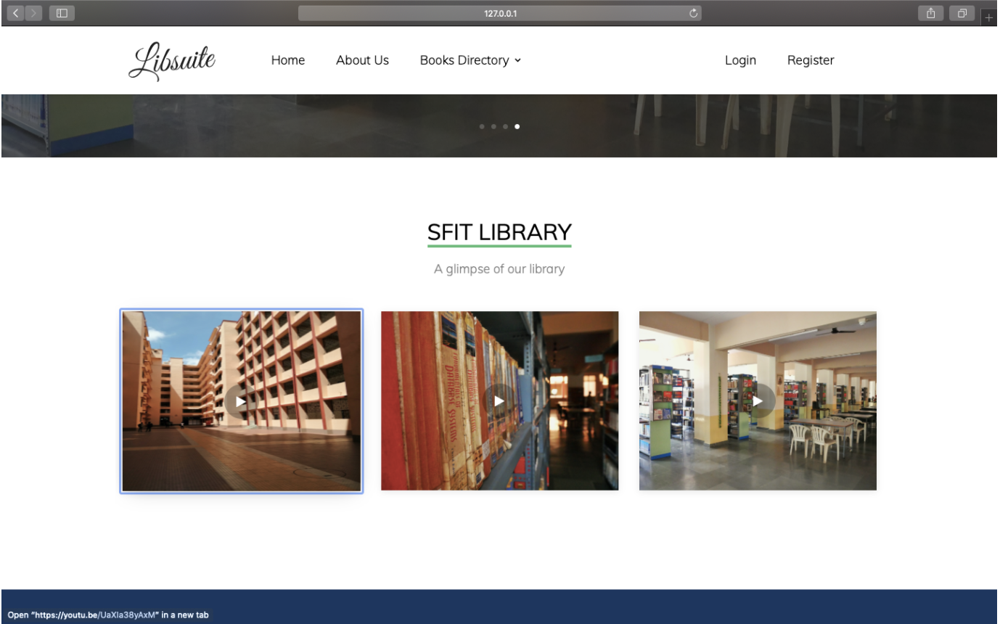
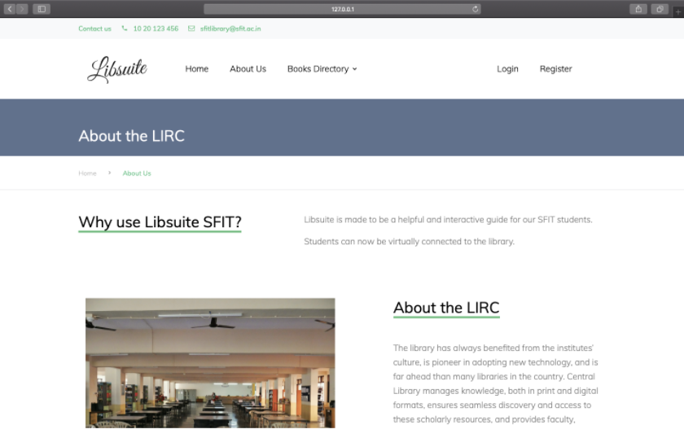
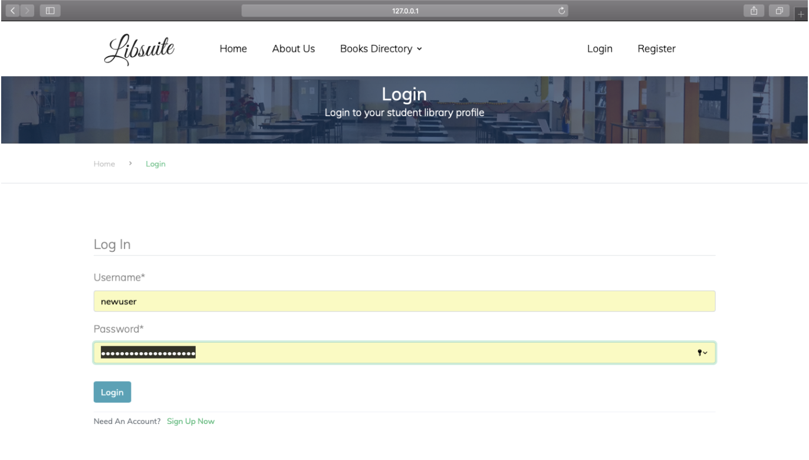
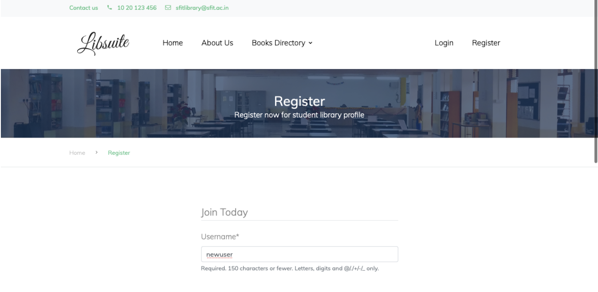
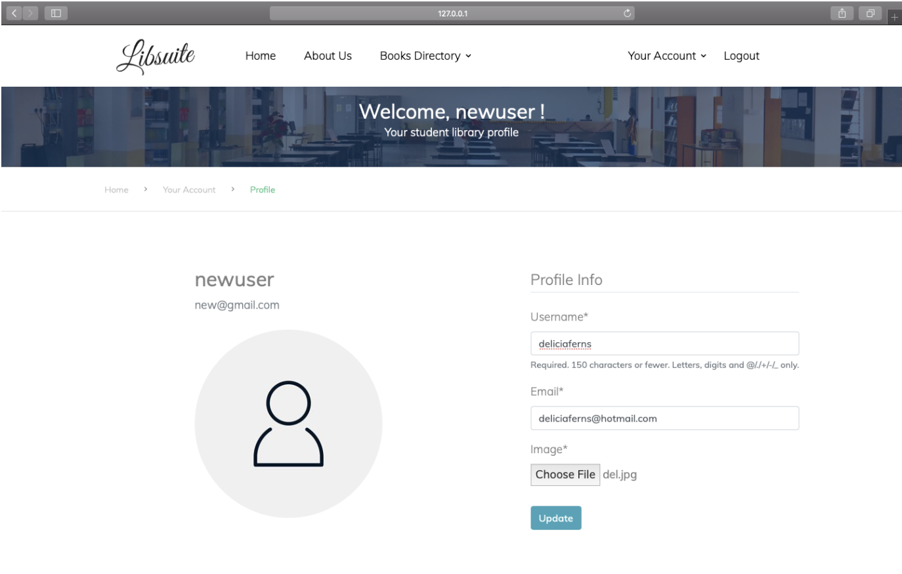
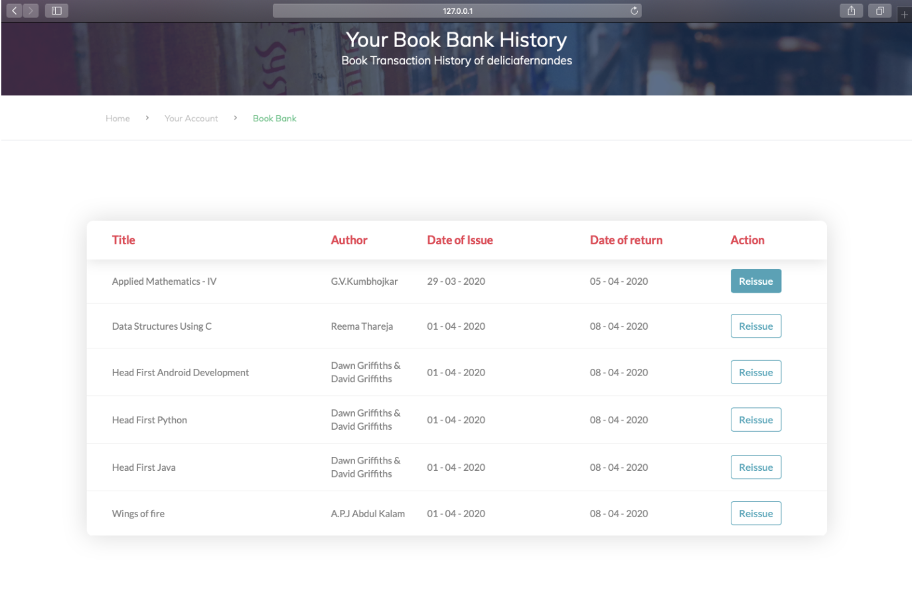

# LibSuite : A Library Management Website :books:

# Table of Contents
1. <a href="#What is LibSuite?">What is LibSuite?</a>
2. <a href="#Tech Stack Involved?">Tech Stack Involved?</a>
3. <a href="#Any Requirements?">Any Requirements?</a>
4. <a href="#File Structure?">File Structure?</a>
5. <a href="#Results?">Results?</a>

## <a name="What is LibSuite?">What is LibSuite?</a>
**‘Libsuite’ is a website that works as a Library Management system.** This website was made so as to help students to access the library better. Students of schools, colleges and universities are ones that make best and most use of a library. But accessing the library can be a little confusing. Where to issue the books from, how to return it, where to find the book needed, etc. are some issues faced by students.‘Libsuite’ is a library management website made in order to settle these problems.

## <a name="Tech Stack Involved?">Tech Stack Involved?</a>
**FRONT END :**
- HTML
- CSS
- BOOTSTRAP
- SCSS
- JAVASCRIPT

**BACKEND :**
- DJANGO
- SQLite 3 ( For testing )
- PostgreSQL ( For production )
- JSON

## <a name="Any Requirements?">Any Requirements?</a>
For the production of ‘ Libsuite ‘ multiple requirements were needed. The main packages that were downloaded/required extra in Django :
Crispy Forms 
Pillow Image Library
	For front end development of  ‘Libsuite’ the following Static files were required :
.css files
.scss files
.js files

For the database, we provided a dummy data of list of books using JSON.

## <a name="File Structure?">File Structure?</a>
The main files working in backend in the following order :
- settings.py
- urls.py
- models.py
- views.py
- Template files

## <a name="Results?">Results?</a>

<table style="width:1920px; border: black; margin: 0px auto;" class="skinny" cellspacing="0" cellpadding="0">
    <tr>
        <td>
            
        </td>
        <td>
            
        </td>
        <td>
            
        </td>
        <td>
            
        </td>
    </tr>
    <tr>
        <th>Home Page</th>
        <th>Home Page Navigation Bar</th>
        <th>Home Page Slider Images</th>
        <th>About Page</th>
    </tr>
    <tr>
        <td>
            
        </td>
        <td>
            
        </td>
        <td>
            
        </td>
        <td>
            
        </td>
    </tr>
    <tr>
        <th>Login page</th>
        <th>Register Page</th>
        <th>Account Profile</th>
        <th>Issued Database Page</th>
    </tr>  
    <tr>
        <td>
            
        </td>
        <td>
            
        </td>
        <td></td>
        <td></td>
    </tr>
    <tr>
        <th>Footer</th>
        <th>Issued Database Page</th>
        <th></th>
        <th></th>
    </tr>
</table>